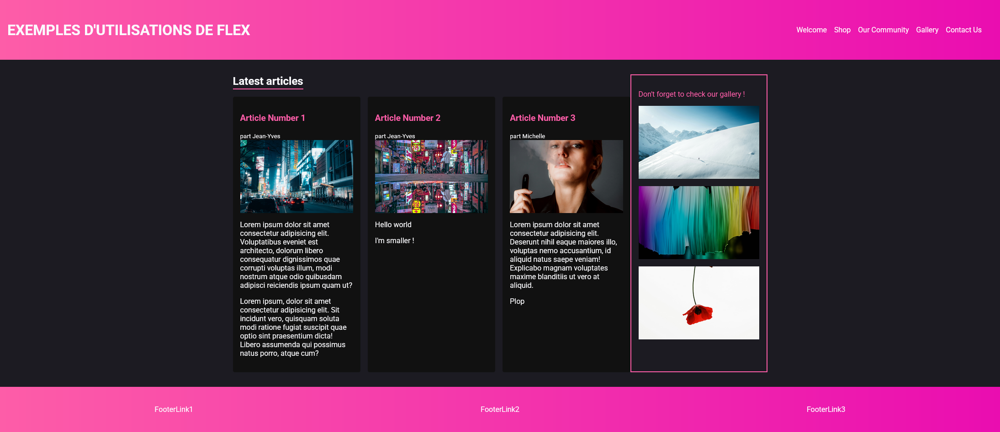
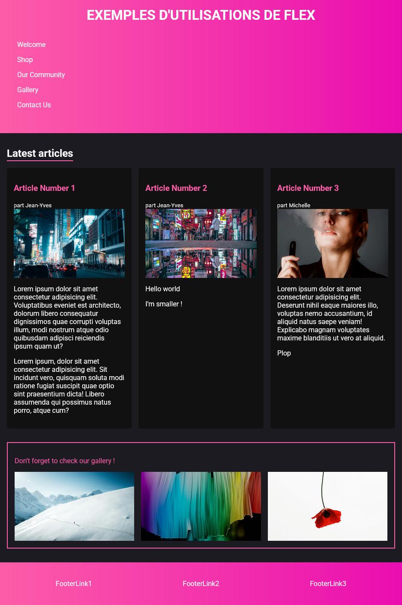
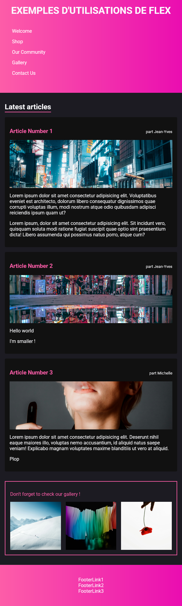

# CSS: Exo sur Flex et les Media Queries

Vous avez à votre disposition:
- index.html (inutile de le modifier)
- style.css (style de base de la page)

Le site a été développé en "mobile-first", c'est à dire que techniquement, l'application est très proche du rendu que l'on attend sur téléphone.

Mais voilà ! Le designer vous a fourni des maquettes pour tailles tablette et desktop (pc bureau) donc il va falloir faire un peu de magie !

> Utilisez flex et les "media queries" pour vous assurer que l'application soit conforme à ce qui a été demandé par le client et ce, sur toutes les tailles d'écrans.

> Référez vous aux captures d'écrans situées dans le dossier "maquettes"

- Bureau

- Tablette

 
- Mobile

