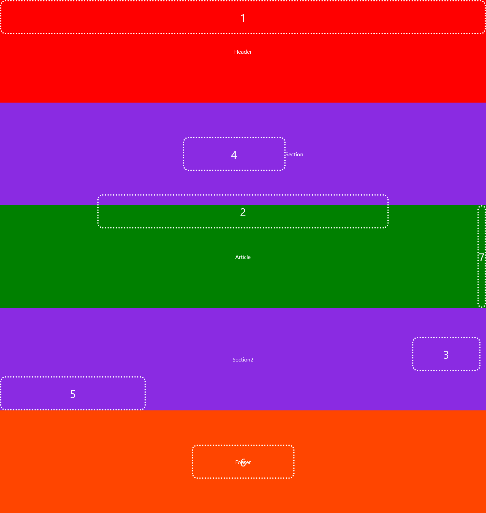

# CSS: Les Positions

Utilisez vos connaissances sur les positions en Css afin de placer correctement des éléments sur la page.

> Les éléments cibles (target) "t1, t2, t3..." sont correctement positionnés

> Dans style.css, définissez les rêgles css des éléments "e1, e2, e3..." de telle façon à ce que e1 soit positionné au même endroit que t1, e2 comme t2 et ainsi de suite.

> Pour se faire, vous devez tour à tour DÉCOMMENTER les éléments "e" et définir leur css dans le fichier style.css
 

