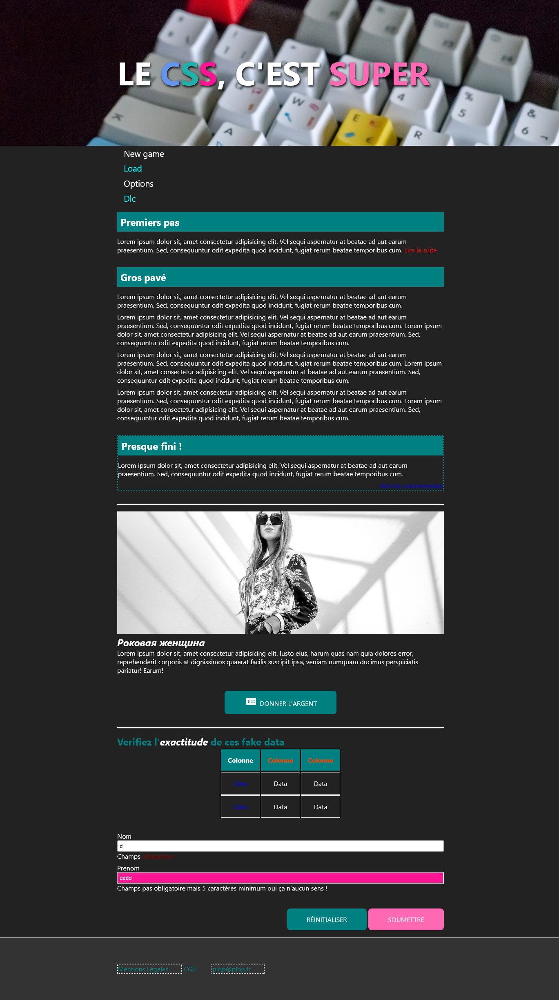

# CSS: Les Selecteurs

Liste des fichiers:
- index.html (ne pas toucher, mais doit être consulté)
- style.css (ne pas toucher, contient le style de base)
- **exo_selecteurs.css (CODEZ ICI)**
- solution.css (ne vous spoilez pas)

Impossible de toucher au Html et de rajouter/modifier des classes existantes.

> Votre seule solution: "viser" précisement les éléments concernés et appliquer les changements demandés.

**Les changements de sont pas très important (pas besoin de retrouver la couleur exacte).**

Le but est uniquement d'arriver à appliquer les changements uniquement sur les éléments concernés.

> 
 
