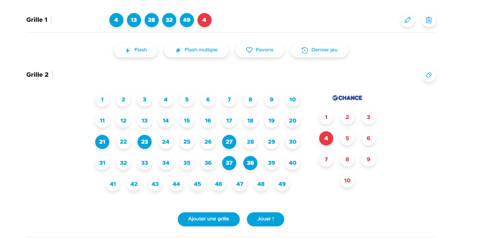
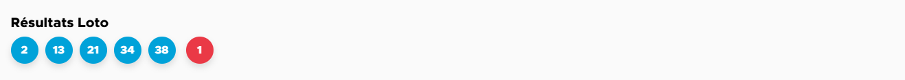
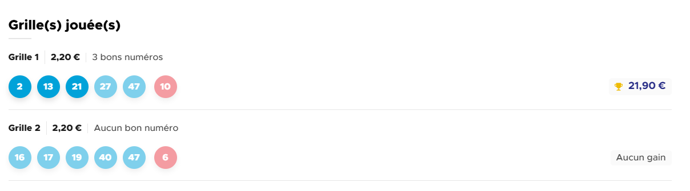

# 🎯 Exercice JavaScript : Simulateur de grilles type Euromillions (FDJ)

## Objectif pédagogique

Créer une application web simple qui simule des grilles de type Euromillions :
- Interactions DOM (sélection de numéros, boutons)
- Génération de nombres aléatoires
- Comparaison de tableaux
- Manipulation d'éléments HTML et stylisation dynamique
- Calcul logique de gains

---

## 🔧 Spécifications fonctionnelles

### 🎟 Remplissage des grilles
- L'utilisateur peut sélectionner **5 numéros entre 1 et 50** et **1 étoiles entre 1 et 12** par grille.
- L'utilisateur peut remplir **plusieurs grilles**.
- Les numéros sont sélectionnés en cliquant dessus.
- Une fois les sélections faites, un bouton **"Jouer!"** déclenche le tirage.

### 🎲 Tirage aléatoire
- Le système génère **5 numéros aléatoires uniques (1-50)** et **1 étoiles aléatoires uniques (1-12)**.
- Le tirage est affiché de manière claire à l'utilisateur.

### 🖌 Affichage des grilles
- Chaque grille de l'utilisateur est affichée avec ses numéros et étoiles.
- Les **bons numéros** (et étoiles) sont **colorés avec un fond bleu et rouge**.
- Les numéros non gagnants restent avec le style par défaut.

---

## 💰 Option bonus : Calcul automatique des gains

À partir du tirage et des grilles jouées, le système affiche **le gain correspondant pour chaque grille**.  
Voici les correspondances classiques des gains Euromillions (à intégrer dans une structure de données JS) :

| Nombres trouvés | Étoiles trouvées | Gain approximatif |
|------------------|------------------|--------------------|
| 5                | 2                | Jackpot 💰          |
| 5                | 1                | 500 000 €          |
| 5                | 0                | 100 000 €          |
| 4                | 2                | 5 000 €            |
| 4                | 1                | 500 €              |
| 4                | 0                | 200 €              |
| 3                | 2                | 50 €               |
| 2                | 2                | 20 €               |
| 3                | 1                | 10 €               |
| 3                | 0                | 8 €                |
| 1                | 2                | 4 €                |
| 2                | 1                | 3 €                |
| 2                | 0                | 2 €                |

### 💡 À noter
- Les combinaisons **non listées** donnent **0 €**.
- Il faudra compter, pour chaque grille, combien de **bons numéros** et **bonnes étoiles** ont été trouvés.

---

## 📦 Technologies à utiliser

- HTML / CSS pour l’affichage
- JavaScript Vanilla (pas de framework requis)

---

## 📝 Conseils

- Organisez le code avec des fonctions claires : `tirageAleatoire()`, `verifierGrille()`, `afficherResultat()`, etc.
- Utilisez des tableaux pour stocker les numéros et étoiles sélectionnés.
- Stylisez les bons résultats avec `element.style.backgroundColor = "green"` par exemple.

---

## ✅ Critères de validation

- ✅ Interface interactive permettant de remplir des grilles valides
- ✅ Tirage aléatoire fonctionnel
- ✅ Affichage correct des résultats et mise en évidence des bons numéros
- ✅ Bonus : calcul automatique des gains par grille
