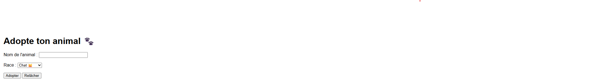
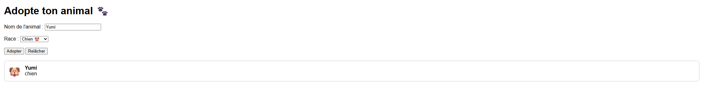
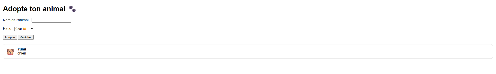

# TP LocalStorage - Adopte ton Animal Virtuel 🐾

## Objectif

Créer une mini-appli où l’utilisateur peut adopter un animal, lui donner un **nom** et une **race**, et l'afficher à l'écran.

L’animal adopté est enregistré dans le `localStorage` : il reste affiché même après avoir rechargé la page !

---

## Fonctionnalités

- Un champ texte : **Nom de l’animal**
- Une liste déroulante : **Race**  
  (Chat, Chien, Dragon, Lama)
- Un bouton "Adopter"
- Quand l’utilisateur clique :
    - L’animal est affiché sous le formulaire avec son nom, sa race et une image correspondante
    - Le nom et la race sont sauvegardés dans `localStorage`
- Quand on recharge la page :
    - L’animal adopté réapparaît automatiquement

---

## Contraintes techniques

- Utiliser :
    - `localStorage.setItem("animal_nom", ...)`
    - `localStorage.setItem("animal_race", ...)`
    - `localStorage.getItem(...)`
- Utiliser `createElement`, `appendChild` pour afficher l’animal
- Pas de JSON, pas de tableaux, juste des strings simples
- Pas de rechargement de page (penser à `preventDefault()` !)

---

## Bonus (facultatif)

- Ajouter un bouton "Relâcher l’animal" → `localStorage.clear()` et supprimer l’affichage
- Ajouter une image ou emoji selon la race :
    - 🐱 Chat
    - 🐶 Chien
    - 🐉 Dragon
    - 🦙 Lama

---

## Conseils

- Vérifie dans le `localStorage` que les données sont bien présentes (`F12 > Application > localStorage`)
- Teste bien au rechargement de la page : est-ce que ton animal s'affiche toujours ?

## Résultat attendu

Un exemple de rendu visuel :

````text
premiere ouverture : 
````



````text
quand je rentre l'animal : 
````


````text
quand je raffraichi ma page si l'animal existe en local storage : 
````


---