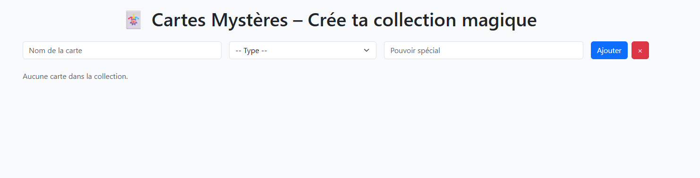
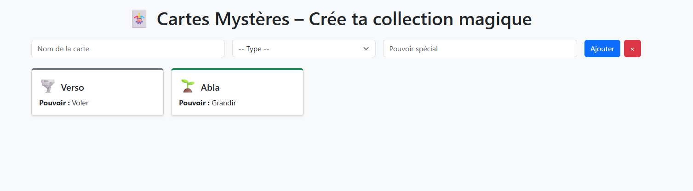

# TP LocalStorage - La Collection Secrète de Cartes Mystères 🃏✨

## Objectif

Créer une mini-application où l’utilisateur peut créer et collectionner des **cartes mystères** (façon Pokémon, Yu-Gi-Oh, etc.).  
Chaque carte a un **nom**, un **type**, et un **pouvoir spécial**.

La collection est sauvegardée dans le `localStorage` sous forme de tableau JSON : elle est restaurée automatiquement au chargement de la page !

---

## Fonctionnalités de base

- Un **formulaire** avec :
    - Un champ texte : **Nom de la carte**
    - Une liste déroulante : **Type**
        - Feu 🔥
        - Eau 💧
        - Terre 🌱
        - Air 🌪️
        - Magie ✨
    - Un champ texte : **Pouvoir spécial**
- Un bouton **"Ajouter à la collection"**

---

## Comportement attendu

- À chaque clic sur le bouton :
    - Une **carte** est créée (objet JS avec nom, type, pouvoir)
    - Elle est ajoutée au **tableau de collection**
    - Le tableau est converti en JSON et stocké dans `localStorage`
    - Toutes les cartes sont (ré)affichées en bas de la page
- Au **chargement de la page** :
    - La collection est rechargée depuis `localStorage`
    - Les cartes sont automatiquement affichées

---

## Contraintes techniques

- Le tableau est stocké avec `localStorage.setItem("collection", JSON.stringify(...))`
- À l’ouverture de la page :  
  `JSON.parse(localStorage.getItem("collection"))`
- Utiliser `createElement`, `appendChild` pour générer les cartes
- Empêcher le rechargement du formulaire (`e.preventDefault()`)

---

## Conseils

- Tu vas avoir besoin de `preventDefault()` pour empêcher le formulaire de recharger la page à la soumission (cherche sur Google : "event.preventDefault formulaire").

- Voici une marche à suivre possible pour bien avancer :
    1. Ajoute un `console.log("formulaire soumis")` dans ton gestionnaire d'événement `submit` pour vérifier que ton script est bien déclenché.
    2. Récupère toutes les infos du formulaire (`nom`, `type`, `pouvoir`) puis affiche-les dans la console avec `console.log()` pour t’assurer qu’elles sont correctes.
    3. Commence par créer un élément `div` (la carte) vide, ajoute-le au DOM, et vérifie qu’il apparaît bien sur la page.
    4. Ajoute ensuite les informations du formulaire dans la carte, une à une, en testant après chaque ajout que tout s’affiche correctement.
    5. Une fois que ça fonctionne, sauvegarde ta collection dans le `localStorage` et teste la persistance au rechargement.
    6. Enfin, implémente la suppression de toute la collection en testant bien la confirmation utilisateur.

- N’hésite pas à ouvrir les outils développeur (`F12`) pour regarder dans la console si des erreurs apparaissent ou si les logs s’affichent comme prévu.

- Pour voir le contenu du `localStorage`, va dans l’onglet **Application > Stockage local (localStorage)** dans tes outils dev.

- Pense à toujours tester chaque petite modification pour éviter d’avoir trop de choses à débugger en même temps.


## Bonus (facultatif)

- Ajouter un bouton **"Effacer toute la collection"**
    - Vide le `localStorage`
    - Vide l’affichage
- Afficher une **emoji ou image** selon le type :
    - 🔥 Feu
    - 💧 Eau
    - 🌱 Terre
    - 🌪️ Air
    - ✨ Magie
- Donner un style différent à chaque type avec des couleurs
- Ajouter une animation d’apparition de la carte

---

## Résultat attendu

Un exemple de rendu visuel :





````text
Au rechargement de la page : 
````


---